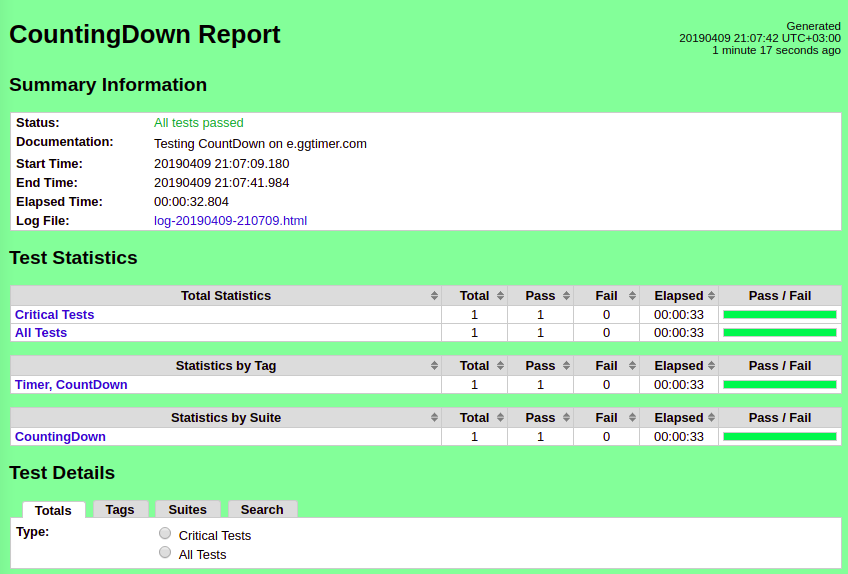

This automated testing of [e.ggtimer](https://e.ggtimer.com) using [RobotFramework](https://robotframework.org/)

#Setting Up RobotFramework Environment

##Prerequisites:
This test was tested on Ubuntu 18.04.
Ensure python2 or python3  is installed on your machine.
Also ensure [pip](https://pip.pypa.io/en/stable/installing/) is installed on your machine.

##Installation:
Assuming you have python on Ubuntu 18.04, both python and the scripts installed with it are automatically placed in the system path, and no more actions are needed.
Once pip is installed, then simply run:

`Pip install robotframework`

Verify Installation:
After installing robot fralsdmework, you should be able to execute the created runner scripts with   --version option and get both Robot Framework and interpreter versions as a result.

                        `robot --version`
                        Robot Framework 3.1.1 (Python 2.7.15rc1 on linux2)

                        `rebot  --version`
                        Rebot 3.1.1 (Python 2.7.15rc1 on linux2)

##Uninstallation
To uninstall the framework from your machine basically involves using pip
                       `Pip uninstall robotframework`

Assuming the Robotframework is well installed on your machine,  then run on your terminal
+ `git clone @https://github.com/Arziki/eggTimer`
+ `cd eggTimer`
+ `mkdir Results`
To run a test, simply run:
`robot -d Results  --timestamp  Tests/CountingDown.robot`
Note:
The above command will create Results directory if not found.

## Improvements

+ add PLATFORM/BROWSER LIMITATIONS (This works on Ubuntu 18.04, and Chrome browser)
+ Verify audio sound

## BUGS
+ At random times, Alert pops off once a value is submitted, even before the end of the countdown period

##Highlights

